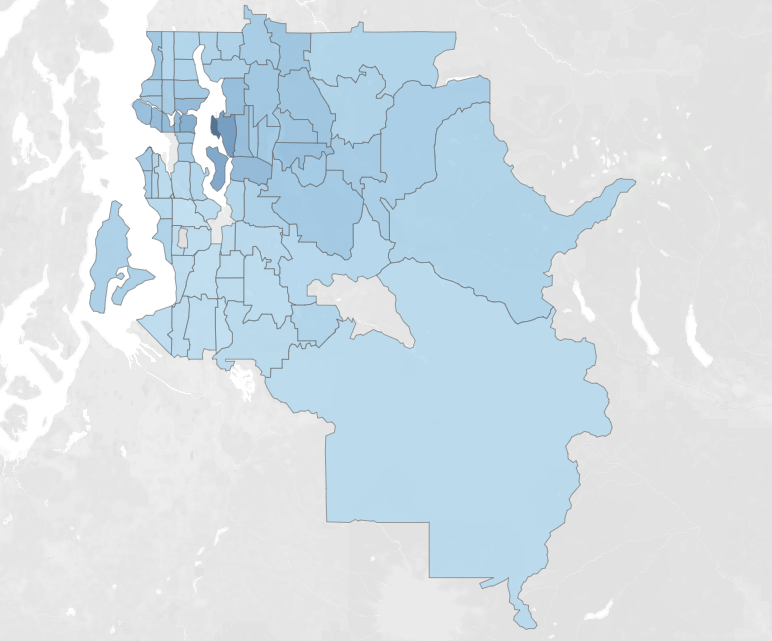
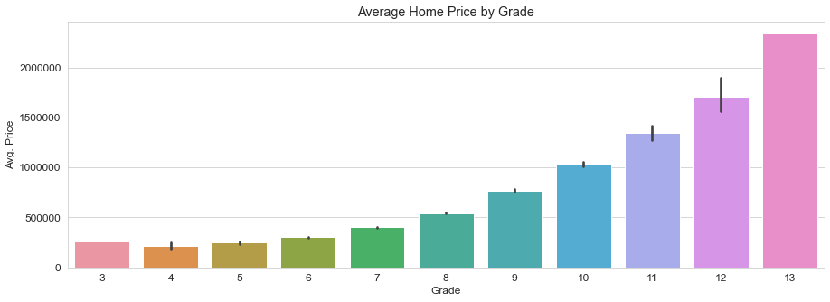
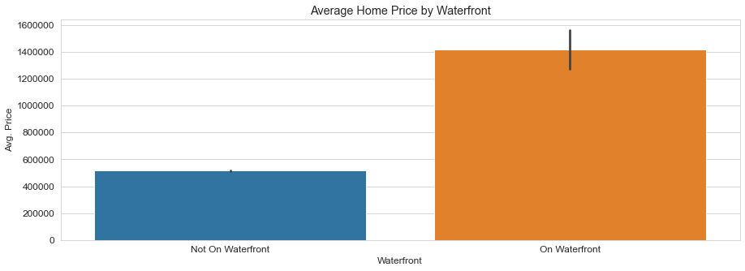
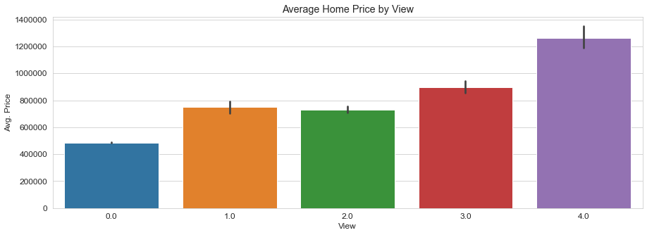
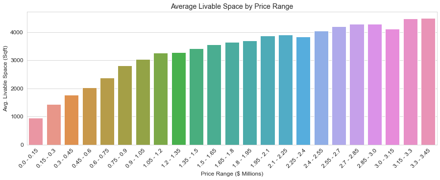
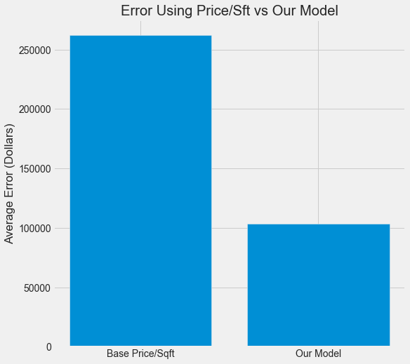

# Predicting Real Estate Sale Prices in King County, WA *<Appraisal Firm>*
 
**Authors**: *Ben Bowman, Anthony Conte, Nina Vergara, Manav Kahlon*
  
## Overview
- [Business Problem](#Business-Problem)
- [Data](#Data)
   - [Housing Data](#Housing-Data)
- [Methods](#Methods)
- [EDA Results: Notable Features](#EDA-Results:-Noteable-Features)
  - [Building Grade](#Building-Grade)
  - [Waterfront Properties](#Waterfront-Properties)
  - [Exposure](#Exposure)
  - [Livable Square Footage](#Livable-Square-Footage)
- [Modeling Results](Modeling-Results)
- [Conclusions](#Conclusions)
- [For More Information](#For-More-Information)
- [Repository Structure](#Repository-Structure)
  

## Business Problem
Acme Appraisals wants to find a more efficient way to predict the price of a house in Seattle when doing its appraisals. We are tasked with making a model that will be the best at predicting the price of a house while limiting the predictions error.   
 
## Data
21,597 records of home sales in King County, WA in 2014 and 2015.  Each record contains 23 columns including, for example, sales price, number of bedrooms and bathrooms, total living space, whether the property in on the water.  
 #### Housing Data
    * kc_house_data.csv
    
    
## Methods
 We first clean the data by handling null values and instituting the correct data types.  We also remove outliers that are three or more standard deviations from the mean in the 'bathrooms', 'bedrooms', and 'sqft_living' features.  We perform some EDA by exploring correlations and inspecting features, then make some inferential plots showing relationships between price and various features.  We create a baseline model for reference, and then begin an iterative process of model-making, creating nine models (plus one baseline model) in total.  For each model, we create training and test data, use cross-validation, and calculate R2 and RMSE.  
    
## EDA Results: Notable Features
 
### Zipcode and Average Price

Looking at the Average Price per zipcode in King County.
 
### Building Grade


 The quality of a build is reflected in price. As grade increases, so does the average price of houses sold within that grade.

 
### Waterfront Properties



 On average, waterfront properties have a higher selling price than their inland counterparts.

 
### Exposure



On average, properties who are viewed at least 4 times will increase the selling price of a property.

 
### Livable Square Footage



For properties whose selling price was under a million, the average livable square footage systematically increases with price range. For houses that are sold for more than a million, this effect seems to flatten out. This indicates that livable square footage could be a valuable feature for the lower priced properties, but that there's other factors at play in determining the price for the more expensive houses. 

 


To test the above theory, we created a model that was heavily weighted on livable square footage. We Compared the average error of this model to a model that considered the previously mentioned features. In accounting for all significant features, we dramatically reduced the predicting error.
    
 
## Modeling Results
Models 7 and 9 are polynomic, the others are not.  We performed a cross validation on each model.  The mean test and train R2 scores for the non-polynomic models (1, 2, 3, 4, 5, 6, 8) are close for each model, suggesting minimal variance.  Of these, model 6 performs the best.  Polynomic model 7 produced a large negative mean test R2 score, suggesting overfitting (besides, the train R2 was lower than model 6 anyway).  Model 9 produced the lowest mean train R2 and RMSE, though there was a discrepancy with the test score, again suggesting overfitting.  
 
 The models produced mean R2 training and test scores, and RMSE's as follows:


    
    
## Conclusions
The average home price in King County is $540,297, with an average price per square foot of $264.  Using this square foot price to predict each house price (a commonly used benchmark) produces a RMSE of $262,267. In order to be useful, our model needs to perform better than this.  Every one of our nine models does this, so based on this metric our model(s) would be useful to the appraisal company.  Model 9 gives the lowest RMSE and just over $100k, though we suspect that there is some overfitting due to discrepancies between R2 scores for the train and test data.  Model 6 is our best non-polynomic model with an RMSE of around $120k (and similar train and test R2 scores), so that is a good option. Overall, the overfitting in model 9 concerns us, so we will accept a higher bias in exchange for less variance and recommend model 6 to the appraisal firm.  
    
    
## For More Information
    
Please review our full analysis in [our Jupyter Notebook](./Notebook.ipynb) or our [Presentation](./presentation.pdf).    
    
## Repositroy Structure
 ```
├── data                                <- Sourced from an external source
├── gitignore                           <- python files to ignore 
├── Notebook.ipynb                      <- The steps taken to acheive our endgoal
├── Presentation.pdf                    <- PDF of our project presentation                        
└── README.md                           <- The README.md

```
